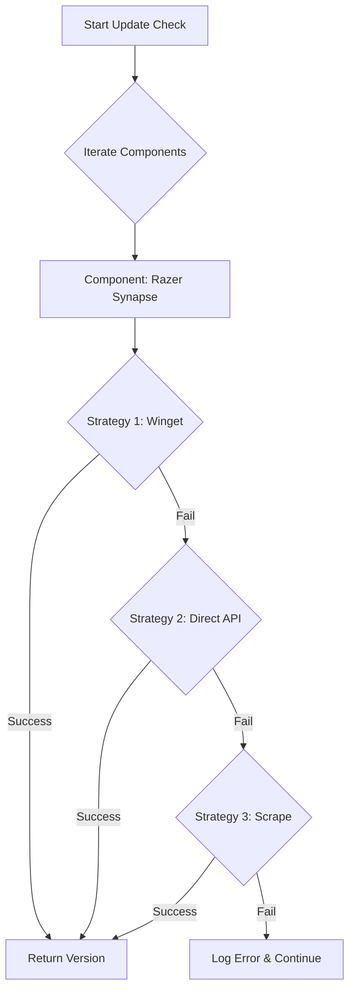

# PC Update Checker: Analysis & Improvement Plan

## 1. Failure Analysis (Scraping Fragility)

The recent failures in the scraping module highlight the inherent instability of using web scraping for version detection on consumer software websites.

| Component | Configured URL | Failure Reason |
|-----------|----------------|----------------|
| **NVIDIA Driver** | `nvidia.com/.../processDriver.aspx` | **Dynamic Content:** The URL is a search processor that likely requires form submission or JavaScript execution to generate the download link/version. Simple HTML regex fails. |
| **ASUS Armoury Crate** | `rog.asus.com/.../armoury-crate/` | **404/Geo-blocking:** The scraper received a 404 or "Page not found" error, possibly due to region redirection or a changed URL structure. |
| **Razer Cortex** | `razer.com/cortex` | **Marketing Page:** The URL points to a product marketing page, which rarely lists specific version numbers in plain text. |
| **Logitech Options+** | `logitech.com/.../logi-options-plus.html` | **Marketing Page:** Similar to Razer, this is a landing page. Version numbers are usually hidden in a "Release Notes" sub-page or a JSON payload. |
| **Steam** | `store.steampowered.com/about/` | **No Version Info:** The "About" page contains an "Install Steam" button but typically does not display the build version text. |
| **Battle.net** | `blizzard.com/.../desktop` | **Marketing Page:** Purely informational. |

**Conclusion:** Scraping "Homepages" is not a viable strategy. It requires constant maintenance as marketing teams update site layouts.

## 2. Proposed Architecture: "Multi-Strategy Fetching"

To improve reliability, we will move from a single `method` per component to a **priority-based strategy list**.

### Workflow Diagram



### New Configuration Schema
Instead of a single `fetching` object, we will support a list of strategies or a primary/fallback model.

```json
"fetching": {
    "strategies": [
        {
            "method": "Winget",
            "packageId": "Razer.Synapse"
        },
        {
            "method": "Scrape",
            "url": "https://mysite.com/release-notes",
            "regex": "v([0-9.]+)"
        }
    ]
}
```

### Strategy Hierarchy
1.  **Winget (Primary):**
    *   **Pros:** Standardized, maintained by community/Microsoft, easy to parse `winget show`.
    *   **Cons:** Requires `winget` installed (standard on Win11), sometimes lags behind "Day 0" releases by a few hours/days.
2.  **Direct API (Secondary):**
    *   **GitHub API:** For open source (PowerToys, VS Code).
    *   **Vendor APIs:** (e.g., NVIDIA has a specific XML/JSON endpoint used by GFE).
3.  **Scraping (Tertiary/Fallback):**
    *   **Target:** "Release Notes" or "Support" pages, NEVER marketing homepages.
    *   **Requirement:** Must target static text.

## 3. Winget Feasibility Check

We need to verify the Package IDs for the failing components.

*   **NVIDIA:** `Nvidia.DisplayDriver` (Very reliable)
*   **Razer Synapse:** `Razer.Synapse`
*   **Razer Cortex:** `Razer.Cortex`
*   **Logitech Options+:** `Logitech.OptionsPlus`
*   **Steam:** `Valve.Steam`
*   **Battle.net:** `Blizzard.BattleNet`
*   **Epic Games:** `EpicGames.EpicGamesLauncher`
*   **Armoury Crate:** `Asus.ArmouryCrate` (Need to verify if this installs the full suite or just the installer).

## 4. Project Gaps & Recommendations

### A. Configuration Management (GUI)
*   **Gap:** Editing JSON is error-prone for users.
*   **Solution:** A simple PowerShell script (`Edit-Config.ps1`) using `System.Windows.Forms` to list components, toggle them, and edit IDs.

### B. Automation (Scheduled Tasks)
*   **Gap:** Tool only runs manually.
*   **Solution:** `Install-Task.ps1` script to register a Windows Scheduled Task that runs the checker daily and triggers a notification if updates are found.

### C. Self-Update
*   **Gap:** The tool itself needs updates.
*   **Solution:** A `Check-SelfUpdate` function that checks the project's GitHub repo (if applicable) or a version file.

## 5. Implementation Plan

1.  **Verify Winget IDs:** Run `winget search` for all target apps.
2.  **Refactor `VersionFetcher`:** Update logic to iterate through `strategies`.
3.  **Update `config.json`:** Convert all failing scrapers to Winget strategies.
4.  **Improve `WingetFetcher`:** Ensure it handles cases where `winget show` returns multiple matches or requires source agreements (already partially handled).
5.  **Retire Bad Scrapers:** Remove the marketing page URLs from config.